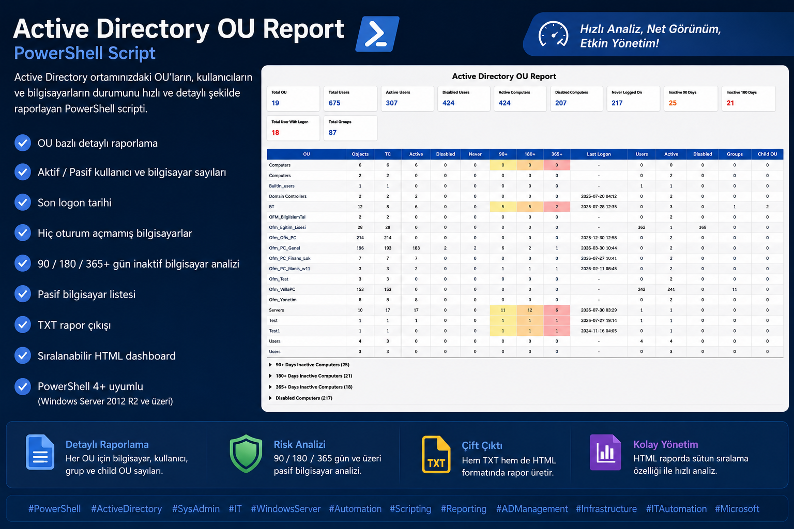

# Active Directory OU Report

PowerShell script for generating detailed Active Directory OU reports.

## Features

- OU based reporting
- Active / Disabled Users
- Active / Disabled Computers
- Never Logged On Computers
- 90 / 180 / 365 Days Inactive Analysis
- TXT Report
- Sortable HTML Dashboard

## Requirements

- Windows Server 2012 R2 or newer
- PowerShell 4+
- Active Directory PowerShell Module

## Output

- OU_Report.html
- OU_Report.txt

## Screenshot

## License

MIT
